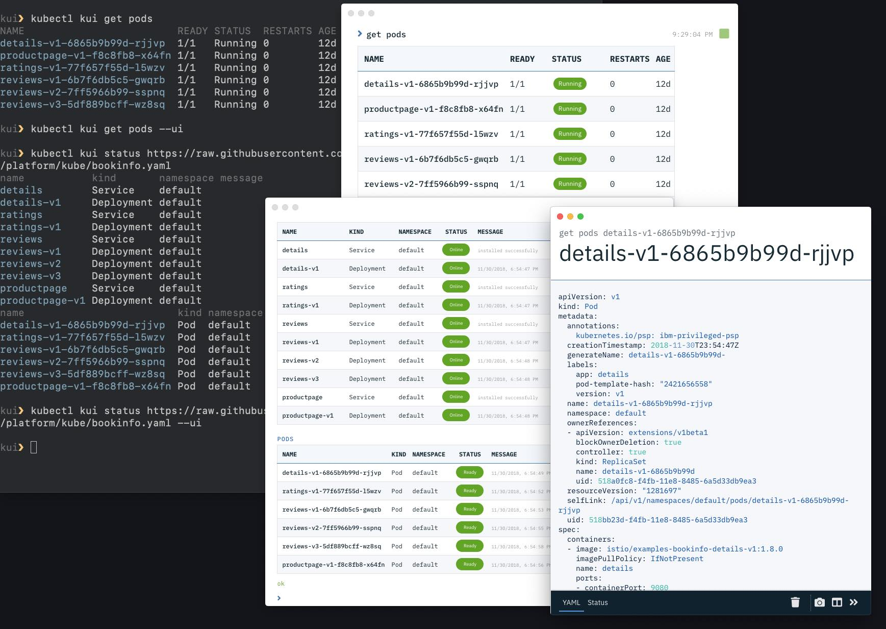

# Kui Shell

[](https://travis-ci.org/IBM/kui)
[](https://opensource.org/licenses/Apache-2.0)
[](https://conventionalcommits.org)

Kui Shell offers a new development experience for building
cloud-native applications. By combining the power of familiar CLIs
with visualizations in high-impact areas, Kui enables you to
manipulate complex JSON and YAML data models, integrate disparate
tooling, and provides quick access to aggregate views of operational
data.

- [Install a prebuilt version](docs/installation.md)
- [Try it Live](https://hello.kui-shell.org/) (this is a webpack build of Kui, simply hosted in an S3 bucket)
- Clone and contribute! `git clone git@github.com:IBM/kui.git && cd kui && npm install`

## The Kui Experience

[](https://youtu.be/jcV0csyzGdY)

Click the image to see [Kui in
motion](https://youtu.be/jcV0csyzGdY). For more of the backstory of
Kui, read on!

## This is a CLI, with Visualizations on the Side

Kui uses [Electron](https://electronjs.org) to provide you with an
augmented but CLI-focused development experience. By using Electron,
the same experience carries over, from local development on your
laptop, to a browser-based experience.

When running locally, you will have access to your filesystem and your
favorite terminal and text editor. To help with complex data, Kui
offers a suite of **visualizations**. You can gracefully flip between
the terminal and these visualizations, without having to switch to
your browser, log in, wait for pages to load, navigate through complex
menu structures, and so on.

For example, if you want a visual summary of your Kubernetes pods, you
can issue this command from your favorite terminal:

```
kubectl kui get pods --ui
```

From there, you can click on one of the rows to drill down to the
details of one of the pods. In the above screenshot, you can see this
shown in the `get pods details-v1-6865b9b99d-rjjvp` window. You could
also have opened this view directly from your terminal, via: 

```
kubectl kui get pod details-v1-6865b9b99d-rjjvp --ui
```

Without the `--ui` option, Kui will display the output in your
terminal directly; you will observe that the output is mostly
identical to that of `kubectl`, except with some syntax
coloration. With Kui, you have the power to navigate between these
modes in a graceful and flexible manner.

Kui also has support for Apache OpenWhisk and Apache Composer.  In all
three cases, from Kubernetes, to serverless, to serverless
composition, the story is the same: you can gracefully transition into
the world of visualizations without altering your normal productive
workflows.

- [More Kubernetes Examples](docs/readme/examples/kubernetes.md)
- [More Apache OpenWhisk Examples](docs/readme/examples/openwhisk.md)
- [More Apache Composer Examples](docs/readme/examples/composer.md)
